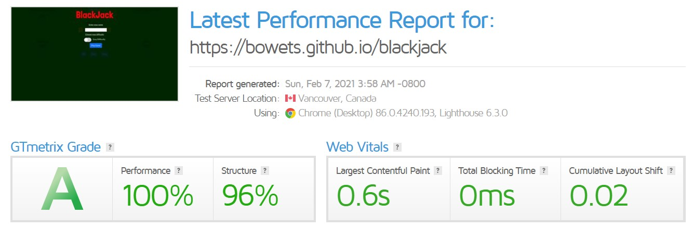

# BlackJack

This is a website created for the purpose of completing the Milestone Project 2 for the Full Stack Software Development Diploma at Code Institute. 

The Milestone 2 project is a chance to showcase my knowledge of Javascript and I chose to make a game. The reason for chosing a game is that it would mostly be written in Javascript with a little HTML and CSS to make the play area. 
BlackJack is one of the most popular casino games and as such, would be easy enough for a beginner, yet challenging enough to show a good knowledge of the language. 
Gaming is one of the fastest growing industries and being able to create games as well as websites is a great skill to have. 

# UX

This project is aimed at anyone who likes BlackJack, likes to play casino games or anyone who ejoys a quick game to pass the time. 
The game has been optimized for most screen sizes and is very straight forward and easy to play. 
The added functionality of locally storing player statistics, allows multiple players to play on the same machine.

## General

The website is designed as a single page with two sections. One section, the overlay acts as a main menu where players can enter their name and choose the difficulty of the game. The second section is the play area where the game is played. 
The navigation between the two sections is done via buttons which clearly state their purpose. Depending on the information requested, it will either be displayed on the main menu (ie. player gameplay statistics) or on the play area (ie. playing the game).
The overall design of the main menu and the play area is as simple as possible to not interfere with the actual gameplay. 

## User Stories

- As a user I expect to play the game of BlackJack
    - When the user navigates to the website, they will be asked to enter their name and choose a diffciulty level. If they do not enter their name, a default "player" will be created and the default diffculty is "easy". The user just needs to click "Play New Game" and they will be taken to the play area. 

- As a user I expect the game to be intuitive
    - Once the player is in the game area, there are several notification boxes which will inform the player what they need to do next. To start the game, they need to place a bet and then click "deal" to start their first hand. 

- As a user I want to change the difficulty setting of the game
    - In the main menu, there is an option to change the difficulty setting. Normal difficulty is playing a regular game of BlackJack. Easy difficulty provides a % chance calculation that the next card will not push the player over 21. The higher the percentage, the more likely the hit will be successfull. 

- As a user I want to be able to turn the sound on or off
    - There is a toggle on the main menu that allows a user to turn the sound on or off. By default, the sound is turned off. 

- As a user I expect to be able to quickly find the information I need

    - All the buttons are clearly marked. If a user presses the wrong button, it will either not perform an action or tell the user what they must do in order to continue.

- As a user I want to easily navigate the page

    - There are only two sections to the game. The main menu and the play area. Moving from one to the other is very easy. To move from the main manu to the play area, the user needs to press the "Play New Game" button. To move back to the main menu from the play area, the user needs to press the "Main Menu" button. 

- As a user I want to view the page on all screen sizes

    - The website is designed as a responsive website which scales depending on the size of the screen it is viewed on. 

- As a user I expect to play a full game of BlackJack with all the rules
    - At the moment, this game is limited to the basic rules of BlackJack. Rules such as "split", "double", etc. were not implemented due to time constraints, but will be implemented in future versions of this game. 

# Features

## Main Menu

The main manu is the first section that greets a user when the navigate to the website. 
The main menu consists of: 
- Large title "BlackJack" to inform the user what the website is about,
- An input area where the user can input their name or username,
- A difficulty toggle. This toggle will change the difficulty level between "easy" and "normal". Easy difficulty is the default value and the page will calculate the odds of a successfull "hit" for the player. This allows the player to make an informed choice whether to "hit" or "stay". The "normal" difficulty level removes this calculation and the player plays a regular game of BlackJack. 
- A sound toggle. This toggle will change the sound on or off for the user. The only sound in the game is the sound of dealing cards on the table. 
- A "Play New Game" button. This button will start a new game and remove the main meny overlay. It will also capture the value of the "Player Name" input field and use it to customize the game. 
- A "Check Player Stats" button. This button will tke the value of the player name input field and present the player with the statistics of their gameplay retrieved from local storage. it will show:
    - How many full games has the player played and how many of those were wins or losses
    - How many hands the player has played and how many of those were wins, losses or draws. 
- A "Delete Player Stats" button. This button will thake the value of the player name input field and remove that player information from local storage. This is in case a user would like to remove or reset their information without changing the information for any other players stored in local storage. 
- A "Clear All Local Data" button. This button will clear the local storage data and all information will be reset / cleared. 

## Play Area

The play area consists of several sections. 
The top section shows how much money do the computer and player have and also there is a button to go back to the main menu. 
The section below that has 4 buttons which, when pressed, increment the amount of money the player would like to be on the current hand. The player can press each button as many times as they would like to increment the bet until eitehr the player or computer has no more money to bet. 
The following row and the last row display the cards in the current hand. The top row displays the computers cards and the bottom row displays the players cards. 
A row in between the cards is the notification area. This area shows the player how many points they have in the current hand and also gives the player information about what is going on in the game. 
Below the notification area are three buttons. "Hit", "Deal" and "Stay". These buttons are essential for playing BlackJak.

## Local Storage
The game utilizes local storage to capture data on the players gameplay. The players total games played and total hands played will be recorded locally and will be kept in local storage until the player decides to clear the data. 
This information will constantly increment and at any point the player will be able to see their total games played since they first started playing. It is further segmented into wins / losses / draw games. 
The game will also welcome new players as well as welcome back existing players with a quick recap of how many games they played and how many of them were wins or losses. 

## Game Difficulty
The game has two levels of difficulty
- Easy: The easy difficulty will calculate the percent chance that the players next card will not bring the player over 21. The way this is calculated is by looking at how many cards which are left in the deck can the player play without going over 21. For example, if the player has a 2 and a King, they have 12 points. This means that the biggest card they can play is a 9. The calculator will go through the remaining deck and check how many cards are left that are 9 or lower and return the percentage back to the player. 
- Normal: The normal difficulty does not show the percent calculation to the user, but the rest of the gameplay is the same. 

## Sound On / Off
The player has the ability to turn the sound in the game on or off. By default, the sound is turned off, but the player has the choice to turn it on. The sound is played whenever a card is dealt. 

## Features left to implement
There are still a few features left to implement and the reason for them not being implemented is either technical knowledge or the submission deadline. In BlackJack, the player (along with regular betting), has the option to either double or split their bet depending on the cards they are dealt. This was not implemented both due to time constraints and technical limitations of the programmer. 

# Technologies Used

## [HTML](https://www.w3.org/standards/webdesign/htmlcss) 
Hypertext Markup Language (HTML) is the basic building block of this website. Used for the basic design and structure of the page. 

## [CSS](https://www.w3.org/standards/webdesign/htmlcss) 
Cascading Style Sheets (CSS) is used to style the design elements and media queries are used to make the site responsive.  

## [Bootstrap 4](https://getbootstrap.com/)
Bootstrap is used to make the website responsive on multiple screen sizes. 

## [Visual Studio Code](https://code.visualstudio.com/)
Microsoft Visual Studio Code is an Integrated Development Environment (IDE) used to develop software. 

## [Git](https://git-scm.com/)
Git was used alongside Visual Studio Code as a local version control platform. All commits were regularly pushed to GitHub. 

## [GTmetrix](https://gtmetrix.com/)
GTmetrix is an online service used to evaluate the load time and performance of websites. 

## [Google Fonts](https://fonts.google.com/)
Google Fonts is a repository of free to use fonts. The fonts used in this project are 'Lato' and 'Londrina Solid'

## [Audacity](https://www.audacityteam.org/)
Audacity is a free audio editing software package. In this project it was used to cut an audio sample from a larger MP3 to be used as the sound for cards beaing dealt. The full audio track was downloaded from [Orange Free Sounds](https://orangefreesounds.com/playing-cards-dealing-sound-effect/) 

## [Google Chrome](https://www.google.com/intl/en_ie/chrome/)
Google Chrome is a web browser developed by Google Inc. In this project Google Chrome was used extensivelly along with Microsoft Edge to preview and test the project with the chrome developer tools.

## [Microsoft Edge](https://www.microsoft.com/en-us/edge)
Microsoft Edge is a web browser developed by Microsoft. In this project Microsoft Edge was used extensivelly along with Google Chrome to preview and test the project with the chrome developer tools.

## [Markdown Table Generator](https://www.tablesgenerator.com/markdown_tables#)
The Markdown Table Generator was used to generate the tables in the readme to display the texting matrix. 

# Resources Used

## [Orange Free Sounds](https://orangefreesounds.com/playing-cards-dealing-sound-effect/)
A track was downloaded from this source and part of it was used to play the sound of cards being dealt. 

## [Resource Center](http://acbl.mybigcommerce.com/52-playing-cards/)
The images for the 52 playing cards were downloaded from this website. The images are given away free to be used.

## [W3Shools](https://www.w3schools.com/howto/howto_css_switch.asp)
The code for the Game Difficulty and Sound On / Off sliders was taken from this resource and is not original code. 

## [Felt Background](https://www.transparenttextures.com/felt.html)
The background texture of the play area has been taken from this source. The background is applied to give the appearance of a felt game area.

# Testing

## Performance testing
To test the performance and loading time of the website, the project was submitted to GTmetrix. The score returned was 100% performance. 

## Testing Methodology
The site was tested on multiple browsers and physical devices. The following methodology was applied:

1. Do all links work?
    - Click all links on the page to ensure they are not broken. 

2. Do all buttons work? 
    - Press all the buttons at various stages of the game. 

2.  Does the game calculate points correctly? 
    - Use Jasmine framework to test calculating functions

3. Does the game differentiate between "Ace" value
    - Use Jasmine framework to calculate different values of "Aces" depending on the circumstance. 

4. Does the betting stop once either the computer or player have run out of money? 
    - Click the quick bet buttons until either the computer or player run out of money

5. Does the game save statistic data?
    - Play the game and check statistics.  

6. Can the game accomodate multiple players on the same macine? 
- Play as multiple players. 

7. Is the page responsive?
    - Does the page and all elements within it resize depending on screen size

## Browser Testing

The project was tested in several browsers all features worked in most browsers. Internet Explorer was tested, however, the game does not work within Internet Explorer. There is only one feature which did not work on Mozilla Firefox: 

- CSS property: backdrop-filter: blur(5px);

This feature is implemented, but dissabled on Mozilla Firefox and threfore it will fall back to a semi transparent background when the main menu overlay is engaged. If the user has this enabled on their machine, the property will display as intended. 

Other browsers that were tested are:
- Google Chrome
- Microsoft Edge
- Opera
- Safari
- mobile versions of all broswers

All browsers, except for Mozilla Firefox and Internet Explorer had full game functionality. 

## Device testing
The project was also tested on multiple devices both physical and virtual (using Chrome and Edge developer tools)

Most device testing was done on virtual devices within Microsof Edge and Google Chrome. There were no issues with any game functionality regardless of device. 
The project was also tested on a Samsung Galaxy S10e as well as a OnePlus Nord mobile phone. The game worked flawlessly. 
Also, the game was tested on a Samsung Galaxy Tab and worked as expected. 
## Validation
### HTML Testing
HTML code was successfully validated using the [W3C Markup Validation Service](https://validator.w3.org/). The testing returned errors that a "article" or "section" tags were not correct tags to use so they were either removed or replaced with "div" tags. Once this was corrected, the validation passed successfully.

### CSS Validation
CSS code was tested using the [Jigsaw W3C CSS Validation Service](https://jigsaw.w3.org/css-validator/) and returned one error. The CSS validator states that on line 121 in the #overlay tag there is a property "backdrop-filter" which does not exist. Through searching for information on this, it seems the reason for this is that "backdrop-filter" is an SVG property and not a CSS standard. This is why the error comes up. However, this property can be read by browsers which is why I chose to leave it in. For those browsers that do not support it (Mozilla Firefox), they fall back to a semi transparent overlay. The source for this information is [Stack Overflow](https://stackoverflow.com/questions/42597938/w3c-css-validator-error-property-text-rendering-doesnt-exist-geometricpreci) and [MDN Web Docs](https://developer.mozilla.org/en-US/docs/Web/CSS/backdrop-filter)

### Javascript Validation
Javascript was validated using [Jshint](https://jshint.com/) and returned no errors. 
The metrics returned by the validator are as follows: 
There are 41 functions in this file.
Function with the largest signature take 4 arguments, while the median is 0.
Largest function has 24 statements in it, while the median is 6.
The most complex function has a cyclomatic complexity value of 13 while the median is 2.

# Deployment

[**BlackJack**](https://bowets.github.io/blackjack/) is deployed and hosted on GitHub Pages. 

The project was developed using Visual Studio Code. Git was used as a local version control platform. All commits were regularly pushed to the GitHub repository. 

Any changes made on the project were pushed to Github and changes could have been seen immediately on the live site on Github pages. 

## Local deployment
To access this poject locally, download the project file by clicking on the green "Code" button at the top of the page.
 

You can either download a ZIP file containing the project and work on it locally or you can copy the link in the dropdown menu and pull the repository into your IDE of choice. 

# Credits
I want to credit my mentor Ignatius Ukwuoma who guided me through this project and always offered very helpful advice. 
I also want to give credit to the Code Institute Slack groups from where I was able to find answers to some of the problems I was trying to solve. 

## Inspiration
The inspiration for this project is my interest in Casino games and games in general. I was always interested in game design and how games are developed. I never had a chance to make one myself until I learned that I could do it with Javascript. 

## Code credits
The code used in this project which is not my own is available in the "Resources Used" section of the readme. 

